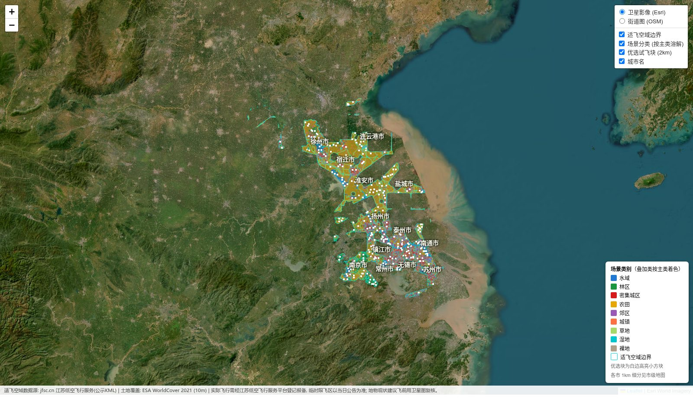
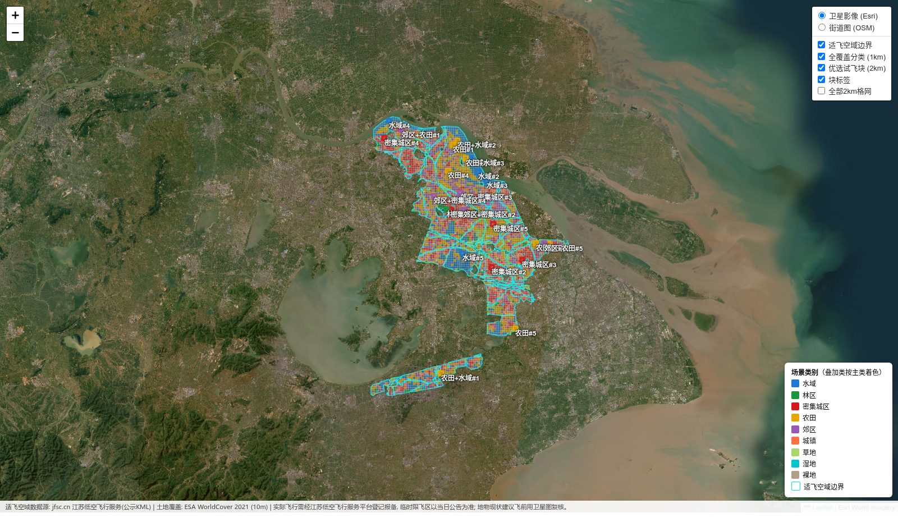
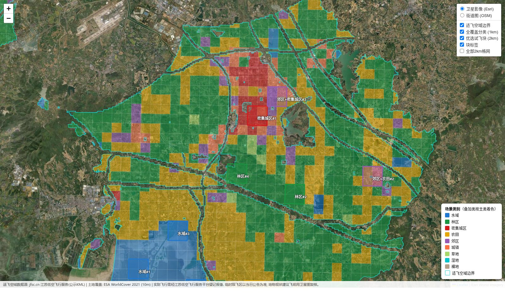

# 江苏省无人机试飞空域场景分块

在江苏省官方公示的无人机适飞空域内，叠加 10m 分辨率土地覆盖数据，为 13 个地市自动划分
无人机飞行测量的场景块（水域 / 林区 / 密集城区 / 农田 / 郊区等），并生成可分享、可缩放、
带标注的交互地图。

## 功能

- **适飞空域提取**：解析江苏低空飞行服务平台（jfsc.cn）公示的适飞空域 KML
  （官网地图的青色图层，13 个地市共 1267 个多边形，WGS-84）
- **全覆盖场景分类（1km）**：适飞空域按 1km 格网裁剪，全省 40,745 个碎块逐块标注
  主类别 + 叠加类别（最多 2 类，如"林区+水域"），并附各地物占比
- **优选试飞块（2km）**：按纯度判据每市每类挑选 3–5 个 2km×2km 高纯度候选块
  （整块 ≥90% 在适飞区内，同类间距 ≥5km），全省共 303 块
- **交互地图**：13 张市级图 + 1 张全省总图，单文件 HTML 可直接分享；
  卫星/街道底图切换、图层开关、点击弹出场景与占比、优选块中文标签
- **多格式导出**：GeoJSON（GIS 分析）、KML（Google Earth / 航线规划软件）、CSV（坐标汇总表）

## 效果示意

**全省总图**（13 市适飞区场景分类 + 303 个优选块白边高亮 + 城市名标注）：



**市级地图**（苏州：1km 全覆盖分类 + 2km 优选块标签，图层可开关）：



**放大细节**（南京溧水：红=密集城区、绿=林区、黄=农田、蓝=水域、紫=郊区，点击任意块看占比）：



## 使用方法

依赖 Python 3.10+ 与 `shapely rasterio pyproj numpy`（流程无随机性，结果可复现）：

```bash
pip install -r requirements.txt

# 1. 下载数据: 适飞空域 KML (~10MB) + 5 张 ESA WorldCover 瓦片 (~460MB, 支持断点续传)
scripts/01_fetch_data.sh

# 2. 解析 KML -> 13 市适飞区 GeoJSON
python3 scripts/02_parse_airspace.py

# 3. 格网分类 (全省约 3 分钟; 可指定城市, 如 nanjing suzhou)
python3 scripts/03_classify_blocks.py [city ...]

# 4. 生成交互地图 (缺省: 13 市 + 全省总图)
python3 scripts/04_make_map.py [city ...]
```

生成结果（`output/`，均可由脚本重新生成，不入库）：

```
output/
├── jiangsu_all.html              # 全省总图
├── {city}/
│   ├── {city}.html               # 市级交互地图
│   ├── coverage_1km.geojson      # 1km 全覆盖分类
│   ├── blocks_selected.geojson   # 2km 优选块
│   ├── blocks_selected.kml       # 同上, Google Earth / 航线规划可导入
│   ├── blocks_summary.csv        # 优选块坐标与占比汇总
│   └── blocks_all.geojson        # 全部合格 2km 格子
└── airspace/{city}.geojson       # 各市适飞空域边界
```

城市名: `nanjing suzhou wuxi changzhou zhenjiang yangzhou taizhou nantong yancheng
huaian suqian xuzhou lianyungang`

地图 HTML 为单文件，微信/邮件直接发送即可分享（打开时需联网加载底图瓦片）。

## 分类逻辑

**全覆盖层（1km）**，按块内 ESA WorldCover 各类占比：

| 规则（按序判定） | 类别 |
|------|------|
| 建成区 ≥60% | 密集城区 |
| 建成区 20–45% 且 农田+草地 ≥40% | 郊区 |
| 其余取占比最高类 | 水域 / 林区 / 农田 / 城镇 / 草地 / 湿地 / 裸地 |

主类之外第二类占比 ≥25% 时追加叠加标签（最多 2 类，如"农田+水域"表示河流穿过农田）。

**优选层（2km）**单类判据：水域 水体≥40% | 林区 林地≥60% | 密集城区 建成区≥60%
（无达标市降至 45%）| 农田 农田≥65% | 郊区 同上 | 湿地 ≥35%；另挑"林区+水域"
"农田+水域"叠加组合。

全省统一 UTM 50N（EPSG:32650）建格网，跨 120°E 城市形变 <5m，对 1–2km 格网可忽略。

## 数据源

- **适飞空域**: https://www.jfsc.cn/data/shifeikongyu.kml —— 江苏低空飞行服务平台公示数据
- **土地覆盖**: [ESA WorldCover 2021 v200](https://esa-worldcover.org/)（10m，CC-BY 4.0），
  AWS S3 公开桶下载，瓦片 N30E117 / N30E120 / N33E114 / N33E117 / N33E120
- **底图**: Esri World Imagery / OpenStreetMap（均 WGS-84 无偏移；勿换高德等 GCJ-02 底图，会与数据错位）

## 注意事项

- 适飞空域为公示数据，**实际飞行仍需通过江苏低空飞行服务平台/小程序登记报备**；
  临时限飞区（节假日等）不在公示 KML 中，飞前查当日公告
  （接口: `POST https://www.jfsc.cn/nuaa/api/airspace/uas/zone/publishList`）
- WorldCover 为 2021 年数据，个别地块现状可能变化，飞前建议卫星图复核
